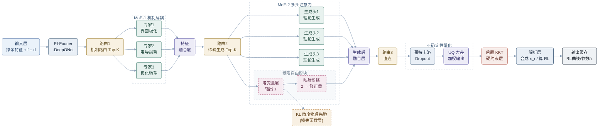

```mermaid
%%{init: {"theme":"base","flowchart":{"nodeSpacing":18,"rankSpacing":34,"padding":8,"curve":"basis","htmlLabels":true}} }%%
%% Advanced Science 风格 · 单行横向紧凑版（架构/连线与原版完全一致，仅改排版与配色）
flowchart LR

    %% ===== 配色：冷色骨架承担数据通路，暖金标记路由决策 =====
    classDef inputBox  fill:#EAF2FA,stroke:#4A6FA5,stroke-width:1.3px,color:#1E3A5F,rx:4px,ry:4px;
    classDef modelBox  fill:#E9EFF6,stroke:#3D5A78,stroke-width:1.3px,color:#1B2A3F,rx:4px,ry:4px;
    classDef routerBox fill:#F8F1E2,stroke:#A98B3E,stroke-width:1.6px,color:#5C4617,rx:4px,ry:4px;
    classDef expertBox fill:#E8F2EF,stroke:#3F7D6E,stroke-width:1.3px,color:#1E463A,rx:4px,ry:4px;
    classDef fusionBox fill:#EDECF7,stroke:#5A56A8,stroke-width:1.3px,color:#2E2A66,rx:4px,ry:4px;
    classDef latentBox fill:#F6EBF1,stroke:#B2567B,stroke-width:1.3px,color:#5B2440,rx:4px,ry:4px,stroke-dasharray:4 3;
    classDef hardBox   fill:#F7ECE9,stroke:#AE4B3C,stroke-width:1.3px,color:#5A241C,rx:4px,ry:4px;
    classDef outputBox fill:#EFF2F5,stroke:#2E3A48,stroke-width:1.3px,color:#141B24,rx:4px,ry:4px;
    classDef lossBox   fill:#F8F0E3,stroke:#BF823A,stroke-width:1.3px,color:#593810,rx:4px,ry:4px,stroke-dasharray:4 3;

    %% ===== 主流程（横向单排，子图内纵向堆叠以压缩宽度） =====
    Input["输入层<br/>掺杂特征 + f + d"]:::inputBox
    Fourier["PI-Fourier<br/>-DeepONet"]:::modelBox
    Router1["路由1<br/>机制路由 Top-K"]:::routerBox

    subgraph MoE1 ["MoE-1 机制解耦"]
        direction TB
        Expert1["专家1<br/>界面极化"]:::expertBox
        Expert2["专家2<br/>电导损耗"]:::expertBox
        Expert3["专家3<br/>极化弛豫"]:::expertBox
    end

    Fusion1["特征<br/>融合层"]:::fusionBox
    Router2["路由2<br/>稀疏生成 Top-K"]:::routerBox

    subgraph MoE2 ["MoE-2 多头注意力"]
        direction TB
        Gen1["生成头1<br/>理论生成"]:::expertBox
        Gen2["生成头2<br/>理论生成"]:::expertBox
        Gen3["生成头3<br/>理论生成"]:::expertBox
        subgraph FreeBlock ["受限自由模块"]
            direction TB
            Latent["潜变量层<br/>输出 z"]:::latentBox
            MapNet["映射网络<br/>z → 修正量"]:::latentBox
        end
    end

    Fusion2["生成后<br/>融合层"]:::fusionBox
    Router3["路由3<br/>直连"]:::routerBox

    subgraph UQ ["不确定性量化"]
        direction TB
        MCDropout["蒙特卡洛<br/>Dropout"]:::modelBox
        WeightUQ["UQ 方差<br/>加权输出"]:::fusionBox
    end

    PostHard["后置 KKT<br/>硬约束层"]:::hardBox
    Analytic["解析层<br/>合成 ε_r / 算 RL"]:::modelBox
    Output["输出缓存<br/>RL曲线/参数/z"]:::outputBox
    KL["KL 散度物理先验<br/>(损失函数层)"]:::lossBox

    %% ===== 连线逻辑（与原版一致） =====
    Input --> Fourier --> Router1
    Router1 --> Expert1
    Router1 --> Expert2
    Router1 --> Expert3

    Expert1 --> Fusion1
    Expert2 --> Fusion1
    Expert3 --> Fusion1

    Fusion1 --> Router2
    Router2 --> Gen1
    Router2 --> Gen2
    Router2 --> Gen3
    Router2 --> Latent

    Latent --> MapNet
    Latent -.-> KL

    Gen1 --> Fusion2
    Gen2 --> Fusion2
    Gen3 --> Fusion2
    MapNet --> Fusion2

    Fusion2 --> Router3
    Router3 --> MCDropout
    MCDropout --> WeightUQ
    WeightUQ --> PostHard
    PostHard --> Analytic
    Analytic --> Output

    %% ===== 子图统一收灰，白底细虚线 =====
    style MoE1 fill:#FFFFFF,stroke:#C4CFDB,stroke-width:1.2px,stroke-dasharray:5 5,color:#3D5A78
    style MoE2 fill:#FFFFFF,stroke:#C4CFDB,stroke-width:1.2px,stroke-dasharray:5 5,color:#3D5A78
    style FreeBlock fill:#F7F9FB,stroke:#DFE6EE,stroke-width:1px,stroke-dasharray:3 3,color:#6A7B8C
    style UQ fill:#FFFFFF,stroke:#C4CFDB,stroke-width:1.2px,stroke-dasharray:5 5,color:#3D5A78

    linkStyle default stroke:#8CA0B8,stroke-width:1.3px,fill:none;
```