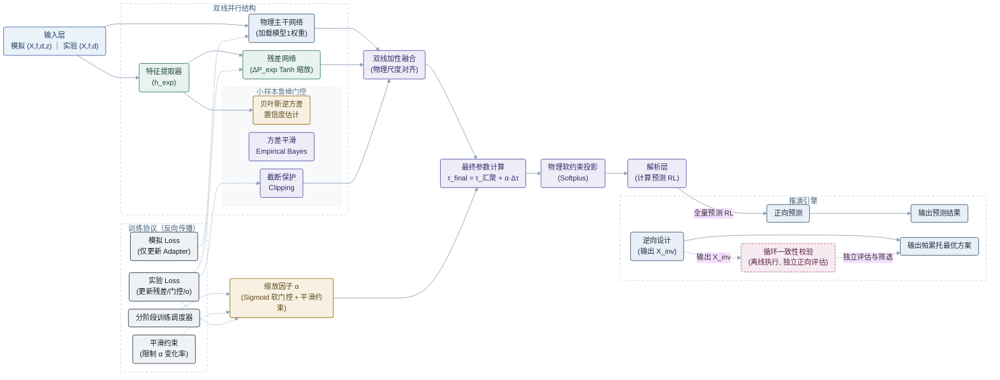

```mermaid
%%{init: {"theme":"base","flowchart":{"nodeSpacing":18,"rankSpacing":34,"padding":8,"curve":"basis","htmlLabels":true}} }%%
%% Advanced Science 风格 · 单行横向紧凑版（架构/连线与原图一致，仅改排版与配色）
%% 配色与图一保持同一套色系，保证双图并列时观感统一
flowchart LR

    %% ===== 配色：冷色骨架承担数据通路，暖金标记门控/路由，青绿标记实验支线 =====
    classDef inputBox  fill:#EAF2FA,stroke:#4A6FA5,stroke-width:1.3px,color:#1E3A5F,rx:4px,ry:4px;
    classDef modelBox  fill:#E9EFF6,stroke:#3D5A78,stroke-width:1.3px,color:#1B2A3F,rx:4px,ry:4px;
    classDef routerBox fill:#F8F1E2,stroke:#A98B3E,stroke-width:1.6px,color:#5C4617,rx:4px,ry:4px;
    classDef expBox    fill:#E8F2EF,stroke:#3F7D6E,stroke-width:1.3px,color:#1E463A,rx:4px,ry:4px;
    classDef mathBox   fill:#EDECF7,stroke:#5A56A8,stroke-width:1.3px,color:#2E2A66,rx:4px,ry:4px;
    classDef trainBox  fill:#EFF2F5,stroke:#2E3A48,stroke-width:1.3px,color:#141B24,rx:4px,ry:4px;
    classDef validBox  fill:#F6EBF1,stroke:#B2567B,stroke-width:1.3px,color:#5B2440,rx:4px,ry:4px,stroke-dasharray:4 3;

    %% ===== 顶部输入 =====
    Input["输入层<br/>模拟 (X,f,d,z) ｜ 实验 (X,f,d)"]:::inputBox

    %% ===== 双线并行结构（并行支线横向并排，门控内部竖排收窄） =====
    subgraph 双线并行结构 ["双线并行结构"]
        SimTrunk["物理主干网络<br/>(加载模型1权重)"]:::modelBox
        ExpFeature["特征提取器<br/>(h_exp)"]:::expBox
        ExpRes["残差网络<br/>(ΔP_exp Tanh 缩放)"]:::expBox

        subgraph 门控模块 ["小样本鲁棒门控"]
            direction TB
            BayesianGate["贝叶斯逆方差<br/>置信度估计"]:::routerBox
            Smoothing["方差平滑<br/>Empirical Bayes"]:::mathBox
            Clipping["截断保护<br/>Clipping"]:::mathBox
        end
    end

    %% ===== 核心运算与约束 =====
    AddParams["双线加性融合<br/>(物理尺度对齐)"]:::mathBox
    Alpha["缩放因子 α<br/>(Sigmoid 软门控 + 平滑约束)"]:::routerBox
    FinalAdd["最终参数计算<br/>τ_final = τ_汇聚 + α·Δτ"]:::mathBox
    SoftPhysProj["物理软约束投影<br/>(Softplus)"]:::mathBox
    Analytic["解析层<br/>(计算预测 RL)"]:::mathBox

    %% ===== 推演引擎（内部竖排，避免横向再拉长） =====
    subgraph 推演引擎 ["推演引擎"]
        direction TB
        Forward["正向预测"]:::modelBox
        Out1["输出预测结果"]:::modelBox
        Inverse["逆向设计<br/>(输出 X_inv)"]:::modelBox
        LoopCheck["循环一致性校验<br/>(离线执行, 独立正向评估)"]:::validBox
        Out2["输出帕累托最优方案"]:::modelBox
    end

    %% ===== 训练协议 =====
    subgraph 训练协议 ["训练协议（反向传播）"]
        direction TB
        LossSim["模拟 Loss<br/>(仅更新 Adapter)"]:::trainBox
        LossExp["实验 Loss<br/>(更新残差/门控/α)"]:::trainBox
        Scheduler["分阶段训练调度器"]:::trainBox
        SmoothConstraint["平滑约束<br/>(限制 α 变化率)"]:::trainBox
    end

    %% ===== 连线逻辑（与原图一致） =====
    Input --> SimTrunk
    Input --> ExpFeature
    ExpFeature --> ExpRes
    ExpFeature --> BayesianGate

    SimTrunk --> AddParams
    ExpRes --> AddParams
    Clipping --> AddParams

    AddParams --> FinalAdd
    Alpha --> FinalAdd
    FinalAdd --> SoftPhysProj
    SoftPhysProj --> Analytic

    Analytic -->|全量预测 RL| Forward
    Forward --> Out1
    Inverse --> Out2
    Inverse -.->|输出 X_inv| LoopCheck
    LoopCheck -.->|独立评估与筛选| Out2

    %% 训练虚线反馈
    Scheduler -.-> Alpha
    SmoothConstraint -.-> Alpha
    LossSim -.-> SimTrunk
    LossExp -.-> ExpRes
    LossExp -.-> Clipping
    LossExp -.-> Alpha

    %% ===== 子图统一收灰，白底细虚线 =====
    style 双线并行结构 fill:#FFFFFF,stroke:#C4CFDB,stroke-width:1.2px,stroke-dasharray:5 5,color:#3D5A78
    style 门控模块 fill:#F7F9FB,stroke:#DFE6EE,stroke-width:1px,stroke-dasharray:3 3,color:#6A7B8C
    style 推演引擎 fill:#FFFFFF,stroke:#C4CFDB,stroke-width:1.2px,stroke-dasharray:5 5,color:#3D5A78
    style 训练协议 fill:#FFFFFF,stroke:#C4CFDB,stroke-width:1.2px,stroke-dasharray:5 5,color:#3D5A78

    linkStyle default stroke:#8CA0B8,stroke-width:1.3px,fill:none;
```