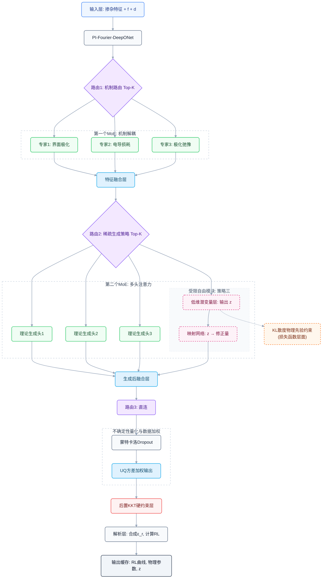

```mermaid
flowchart TD
    %% 核心配色与样式定义（极简学术风）
    classDef inputBox fill:#EFF6FF,stroke:#3B82F6,stroke-width:1.5px,color:#1E3A8A,rx:6px,ry:6px;
    classDef modelBox fill:#F8FAFC,stroke:#64748B,stroke-width:1.5px,color:#1E293B,rx:6px,ry:6px;
    classDef routerBox fill:#F3E8FF,stroke:#8B5CF6,stroke-width:1.5px,color:#4C1D95,rx:6px,ry:6px;
    classDef expertBox fill:#F0FDF4,stroke:#22C55E,stroke-width:1.5px,color:#14532D,rx:6px,ry:6px;
    classDef fusionBox fill:#E0F2FE,stroke:#0EA5E9,stroke-width:1.5px,color:#0C4A6E,rx:6px,ry:6px;
    classDef latentBox fill:#FDF2F8,stroke:#DB2777,stroke-width:1.5px,color:#831843,rx:6px,ry:6px,stroke-dasharray:4 4;
    classDef hardBox fill:#FEF2F2,stroke:#EF4444,stroke-width:1.5px,color:#7F1D1D,rx:6px,ry:6px;
    classDef outputBox fill:#F1F5F9,stroke:#334155,stroke-width:1.5px,color:#0F172A,rx:6px,ry:6px;
    classDef lossBox fill:#FFF7ED,stroke:#F97316,stroke-width:1.5px,color:#7C2D12,rx:6px,ry:6px,stroke-dasharray:4 4;

    %% 主流程
    Input["输入层: 掺杂特征 + f + d"]:::inputBox
    Fourier["PI-Fourier-DeepONet"]:::modelBox
    Router1{"路由1: 机制路由 Top-K"}:::routerBox
    
    subgraph MoE1 ["第一个MoE: 机制解耦"]
        Expert1["专家1: 界面极化"]:::expertBox
        Expert2["专家2: 电导损耗"]:::expertBox
        Expert3["专家3: 极化弛豫"]:::expertBox
    end
    
    Fusion1["特征融合层"]:::fusionBox
    Router2{"路由2: 稀疏生成策略 Top-K"}:::routerBox
    
    subgraph MoE2 ["第二个MoE: 多头注意力"]
        Gen1["理论生成头1"]:::expertBox
        Gen2["理论生成头2"]:::expertBox
        Gen3["理论生成头3"]:::expertBox
        subgraph FreeBlock ["受限自由模块: 策略三"]
            Latent["低维潜变量层: 输出 z"]:::latentBox
            MapNet["映射网络: z → 修正量"]:::latentBox
        end
    end
    
    Fusion2["生成后融合层"]:::fusionBox
    Router3["路由3: 直连"]:::routerBox
    
    subgraph UQ ["不确定性量化与数据加权"]
        MCDropout["蒙特卡洛Dropout"]:::modelBox
        WeightUQ["UQ方差加权输出"]:::fusionBox
    end
    
    PostHard["后置KKT硬约束层"]:::hardBox
    Analytic["解析层: 合成ε_r, 计算RL"]:::modelBox
    Output["输出缓存: RL曲线, 物理参数, z"]:::outputBox
    KL["KL散度物理先验约束\n(损失函数层面)"]:::lossBox

    %% 连线逻辑
    Input --> Fourier --> Router1
    Router1 --> Expert1
    Router1 --> Expert2
    Router1 --> Expert3
    
    Expert1 --> Fusion1
    Expert2 --> Fusion1
    Expert3 --> Fusion1
    
    Fusion1 --> Router2
    Router2 --> Gen1
    Router2 --> Gen2
    Router2 --> Gen3
    Router2 --> Latent
    
    Latent --> MapNet
    Latent -.-> KL
    
    Gen1 --> Fusion2
    Gen2 --> Fusion2
    Gen3 --> Fusion2
    MapNet --> Fusion2
    
    Fusion2 --> Router3
    Router3 --> MCDropout
    MCDropout --> WeightUQ
    WeightUQ --> PostHard
    PostHard --> Analytic
    Analytic --> Output

    %% 强制将子图底色改为纯白并去除土黄色底色，提升高级感
    style MoE1 fill:#ffffff,stroke:#cbd5e1,stroke-width:1.5px,stroke-dasharray: 5 5,color:#334155
    style MoE2 fill:#ffffff,stroke:#cbd5e1,stroke-width:1.5px,stroke-dasharray: 5 5,color:#334155
    style FreeBlock fill:#f8fafc,stroke:#e2e8f0,stroke-width:1px,stroke-dasharray: 3 3,color:#475569
    style UQ fill:#ffffff,stroke:#cbd5e1,stroke-width:1.5px,stroke-dasharray: 5 5,color:#334155

    %% 统一连线样式
    linkStyle default stroke:#94A3B8,stroke-width:1.5px,fill:none;
```