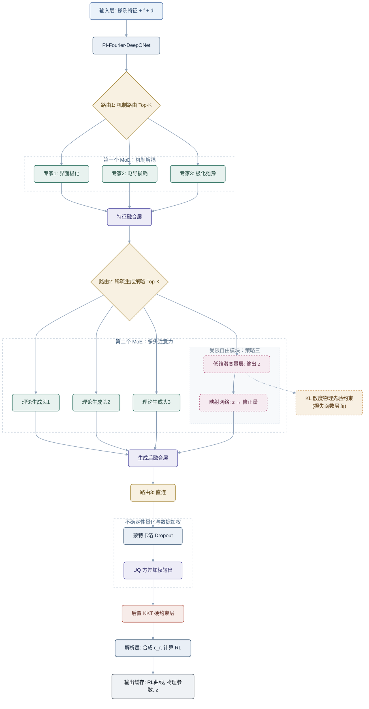

```mermaid
%%{init: {"theme":"base", "flowchart":{"nodeSpacing":42, "rankSpacing":55, "curve":"basis"}}}%%

flowchart TD
    %% 配色定义（深冷学术风：冷色系为骨架，暖金色做决策强调）
    classDef inputBox fill:#EAF2FA,stroke:#4A6FA5,stroke-width:1.5px,color:#1E3A5F,rx:6px,ry:6px;
    classDef modelBox fill:#E9EFF6,stroke:#3D5A78,stroke-width:1.5px,color:#1B2A3F,rx:6px,ry:6px;
    classDef routerBox fill:#F8F1E2,stroke:#A98B3E,stroke-width:1.5px,color:#5C4617,rx:6px,ry:6px;
    classDef expertBox fill:#E8F2EF,stroke:#3F7D6E,stroke-width:1.5px,color:#1E463A,rx:6px,ry:6px;
    classDef fusionBox fill:#EDECF7,stroke:#5A56A8,stroke-width:1.5px,color:#2E2A66,rx:6px,ry:6px;
    classDef latentBox fill:#F6EBF1,stroke:#B2567B,stroke-width:1.5px,color:#5B2440,rx:6px,ry:6px,stroke-dasharray:4 4;
    classDef hardBox fill:#F7ECE9,stroke:#AE4B3C,stroke-width:1.5px,color:#5A241C,rx:6px,ry:6px;
    classDef outputBox fill:#EFF2F5,stroke:#2E3A48,stroke-width:1.5px,color:#141B24,rx:6px,ry:6px;
    classDef lossBox fill:#F8F0E3,stroke:#BF823A,stroke-width:1.5px,color:#593810,rx:6px,ry:6px,stroke-dasharray:4 4;

    %% 主流程
    Input["输入层: 掺杂特征 + f + d"]:::inputBox
    Fourier["PI-Fourier-DeepONet"]:::modelBox
    Router1{"路由1: 机制路由 Top-K"}:::routerBox

    subgraph MoE1 ["第一个 MoE：机制解耦"]
        Expert1["专家1: 界面极化"]:::expertBox
        Expert2["专家2: 电导损耗"]:::expertBox
        Expert3["专家3: 极化弛豫"]:::expertBox
    end

    Fusion1["特征融合层"]:::fusionBox
    Router2{"路由2: 稀疏生成策略 Top-K"}:::routerBox

    subgraph MoE2 ["第二个 MoE：多头注意力"]
        Gen1["理论生成头1"]:::expertBox
        Gen2["理论生成头2"]:::expertBox
        Gen3["理论生成头3"]:::expertBox
        subgraph FreeBlock ["受限自由模块：策略三"]
            Latent["低维潜变量层: 输出 z"]:::latentBox
            MapNet["映射网络: z → 修正量"]:::latentBox
        end
    end

    Fusion2["生成后融合层"]:::fusionBox
    Router3["路由3: 直连"]:::routerBox

    subgraph UQ ["不确定性量化与数据加权"]
        MCDropout["蒙特卡洛 Dropout"]:::modelBox
        WeightUQ["UQ 方差加权输出"]:::fusionBox
    end

    PostHard["后置 KKT 硬约束层"]:::hardBox
    Analytic["解析层: 合成 ε_r, 计算 RL"]:::modelBox
    Output["输出缓存: RL曲线, 物理参数, z"]:::outputBox
    KL["KL 散度物理先验约束<br/>(损失函数层面)"]:::lossBox

    %% 连线逻辑（与原版一致，未改动）
    Input --> Fourier --> Router1
    Router1 --> Expert1
    Router1 --> Expert2
    Router1 --> Expert3

    Expert1 --> Fusion1
    Expert2 --> Fusion1
    Expert3 --> Fusion1

    Fusion1 --> Router2
    Router2 --> Gen1
    Router2 --> Gen2
    Router2 --> Gen3
    Router2 --> Latent

    Latent --> MapNet
    Latent -.-> KL

    Gen1 --> Fusion2
    Gen2 --> Fusion2
    Gen3 --> Fusion2
    MapNet --> Fusion2

    Fusion2 --> Router3
    Router3 --> MCDropout
    MCDropout --> WeightUQ
    WeightUQ --> PostHard
    PostHard --> Analytic
    Analytic --> Output

    %% 子图统一收灰，纯白底 + 细虚线边框
    style MoE1 fill:#FFFFFF,stroke:#C4CFDB,stroke-width:1.5px,stroke-dasharray:5 5,color:#3D5A78
    style MoE2 fill:#FFFFFF,stroke:#C4CFDB,stroke-width:1.5px,stroke-dasharray:5 5,color:#3D5A78
    style FreeBlock fill:#F7F9FB,stroke:#DFE6EE,stroke-width:1px,stroke-dasharray:3 3,color:#6A7B8C
    style UQ fill:#FFFFFF,stroke:#C4CFDB,stroke-width:1.5px,stroke-dasharray:5 5,color:#3D5A78

    %% 连线统一
    linkStyle default stroke:#8CA0B8,stroke-width:1.5px,fill:none;
```